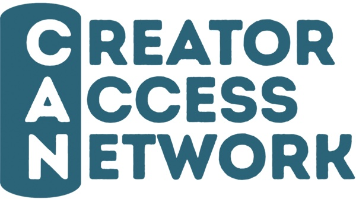

## A. Header

Wise Words by SendOwl
April 20, 2026

## B. The Number

**$30 billion**

That's Anthropic's annualized revenue run rate as of April, up from $9 billion at the end of 2025 and $1 billion a year before that. The tools showing up in every creator's workflow are scaling faster than the creator economy itself.

## C. Hey, it's the SendOwl team!

Hey, it's the SendOwl team!

Big day. The [Creator Access Network launches today](https://www.creatoraccessnetwork.com/a/2148259027/3rtbD7XG), and we're one of its founding partners. CAN is a curated membership built for creators who are tired of paying full price for every tool, platform, and service while they build. SendOwl is on the partner list, so CAN members get 40% off their first year with us, up to $400 in savings. More below.

A few other things we're thinking about this week. Anthropic just passed a $30 billion annualized run rate, tripling from $9 billion in four months. Darryl at Final Fantasy Union funded two books on Kickstarter, the second in 14 minutes. And we published the most thorough tax reference for digital sellers we've ever put out, covering eight countries in one place.

The through-line: the flashy stuff is loud, the operational fundamentals are quiet, and the second bucket is what lets a creator business actually last.

More on all of that below.

## D. Partnership Launch

### We're a founding partner of the Creator Access Network

If you've ever spent a Saturday comparing pricing across email platforms, video editors, banking products, accounting services, and merch storefronts, **the Creator Access Network was built for you.** It launches today, and we're proud to be on the founding partner roster.

CAN is a curated membership program that gives creators access to pre-negotiated deals across 35+ tools and services: newsletters, video, music, accounting, banking, legal, payments, design, and digital product platforms. Every offer is negotiated specifically for CAN members. It is not a deal aggregator.

**40% off your first year of SendOwl.** Up to $400 in savings on any paid SendOwl plan, redeemable from inside the CAN member dashboard the moment you join.

**35+ other partner offers across the rest of your stack.** 25% off beehiiv for a year, 30% off Teachable, 50% off Nas.io, 50% off Epidemic Sound, first year free of the Creator's Guild of America, extended 60-day Kajabi trial, and a long list more across video, banking, legal, design, and productivity tools.

**Revshare upside on affiliate income.** CAN includes partnerships with 20,000+ brands paying 10% more than equivalent multi-retailer affiliate platforms. For every $10,000 you currently make from affiliate links, that works out to roughly $1,000 in additional income over a year.

Across the full set of offers, CAN estimates members can save **$15,000+ in total value** across a year of building and operating. The membership has a money-back guarantee, so there is no risk in trying it.

We joined because the partner list reflects tools we would recommend independently: beehiiv for newsletters, Teachable for courses, Mercury for banking, Epidemic Sound for music, Cookie Finance for tax and bookkeeping, the Creator's Guild of America for representation. A curated network of pre-negotiated deals is more useful to a serious creator than another generic discount site.

Ready to join? [Join the Creator Access Network →](https://www.creatoraccessnetwork.com/a/2148259027/3rtbD7XG)

## E. The Deep Dive

### We wrote the tax and VAT guide we wish we'd had

A creator based in California sells a $20 ebook to someone in Zurich. Her total worldwide revenue last year was $150,000. Does she owe Swiss VAT?

Yes. Switzerland's registration threshold isn't based on her Swiss sales. It's based on her global revenue, and the trigger is CHF 100,000 (about $110,000). Once she crosses it, one Swiss consumer sale puts her in registration territory, and she needs a Swiss-resident tax representative to complete the paperwork. Nobody builds an ecommerce course for digital creators that explains this.

Last week we published the most thorough tax reference we've ever put out. **It's a 22,000-word guide covering eight jurisdictions: the US, UK, European Union, Canada, Australia, Switzerland, New Zealand, and Singapore.** Every threshold, rate, and filing cadence is cited to a primary government source. A few things that surprised us as we put it together:

**The UK has no registration threshold for non-UK digital sellers.** UK residents get a £90,000 threshold. A US creator selling to UK consumers technically owes UK VAT from the first £5 sale. There is no "don't worry about it under X" escape hatch.

**The EU's two-pieces-of-evidence rule has been in place since 2015.** Every B2C digital sale to an EU consumer requires you to keep two non-contradictory pieces of buyer-location evidence (the standard pair is billing address and IP address), stored for ten years.

**The US 1099-K threshold reverted in July 2025.** The scheduled $600 threshold is no longer in effect. Payment processors now only issue 1099-Ks at $20,000 and 200+ transactions. But several states didn't conform to the federal revert and still issue forms at $600.

**Manitoba's Retail Sales Tax now covers SaaS, PaaS, and IaaS.** As of January 1, 2026, at 7%. Non-resident providers owe the tax from the first Manitoba sale with no de minimis threshold. Bill 46 was enacted November 6, 2025.

**Finland's reduced rate for ebooks dropped from 14% to 13.5% on January 1, 2026.** Ebooks sit at the reduced rate in most EU countries, and the rates change often enough that most two-year-old checkouts are wrong about at least one country.

The full guide covers the rest: place-of-supply rules, B2B reverse charge mechanics, how to register for the EU Non-Union OSS from outside the EU, the automation tools that handle this for you (and the merchants-of-record that take the compliance burden entirely off your hands), and a cross-cutting section on what every creator's checkout should collect regardless of where you sit against today's thresholds.

**The takeaway, if you skim nothing else:** tax is the least exciting part of running a digital product business. It is also the part that can erase a year of profit overnight if you get it wrong. A good checkout collects the right buyer-location evidence from day one. A good delivery platform retains the right records for the right number of years. A good tool stack makes the filing step automatic.

Read the full guide: [The complete tax and VAT guide for digital product sellers](https://www.sendowl.com/blog/tips-and-advice/tax-vat-basics-digital-sellers)

## F. Seller Spotlight

### Darryl K. & Final Fantasy Union

Darryl's second Final Fantasy book funded on Kickstarter in 14 minutes.

He'd been running Final Fantasy Union for nearly two decades by then. The project started as a news portal in 2008, added a podcast, then a YouTube channel in 2016. By last year he had 325,000 YouTube subscribers and a community he'd built without ever chasing growth or buying it. Traditional publishers rejected his first book proposal, citing skepticism that YouTube audiences convert to physical product buyers. He crowdfunded it instead.

The Legacy of the Crystal is a 60,000-word encyclopedic history of 135 Final Fantasy games. The Kickstarter goal was £8,500. It hit £114,184 in under 90 minutes from 1,695 backers. The second book, The Guardians of the Crystal, funded at 700% of goal on day one and raised over £56,000. Both sell as £12.50 digital PDFs through SendOwl.

The turning point Darryl talks about wasn't either launch. It was being made redundant from his day job one week after committing to the second book project. Years of conservative financial planning meant he had a buffer. "It wasn't a welcome change, but it wasn't an unwelcome change," he says.

His daily discipline: 15 minutes of writing, five days a week, protected mornings for creative work, afternoons for operations. He personally answers every customer support email after launches and has turned down publisher partnerships to keep direct accountability. "I wanted to be responsible. If something's gone wrong, I don't want to blame someone else."

The thing that stands out about Darryl's story is what he calls the business catching him. Eighteen years of building something specific for a specific audience, and when the day job ended, the business was already ready.

[Read the full Final Fantasy Union story →](https://www.sendowl.com/blog/seller-stories/ff-union-darryl-k)

## G. Quick Wins

**Collect two pieces of buyer-location evidence at every checkout.** The EU requires it, Australia requires it, New Zealand requires it, Singapore requires it. The pair almost everyone uses is billing address plus IP address. Capture both at the moment of sale and store them with the order. Retrofitting this for old orders is impossible.

**Write 15 minutes a day before you try to write for two hours.** Darryl wrote a 60,000-word book in 15-minute daily sessions. The discipline beats the marathon, and the product ships faster than the version where you wait for a clear Saturday.

**Store proof of delivery for every digital download.** PayPal's seller protection for digital goods is narrower than most sellers assume, and the one thing that defends a chargeback is a delivery log that ties a specific file to a specific buyer at a specific timestamp. If your current setup can't produce that, [fix the delivery layer](https://www.sendowl.com/secure-downloads) before you need it.

## H. What's New at SendOwl

**Your dashboard just got cleaner.** We shipped a set of dashboard updates in March, and a few of you wrote in to say it made a real difference to your weekly review. Three changes are worth mentioning.

**Plan limits at a glance.** The homepage now surfaces potential overages and your current usage directly, so you aren't hunting through settings to figure out where you stand.

**Cleaner 30-day income summary.** The rolling income view is easier to read at a glance, which matters if you're the kind of owner who checks the number every morning before opening anything else.

**Tidier activity feed.** New orders stand out, and any actions you need to take are easy to spot without scrolling. We know how much mental energy goes into running a digital business. We want the dashboard to reduce that load, not add to it.

## I. Creator Economy News

**[Picsart launches Earn with Picsart, a monetization program without follower thresholds](https://techcrunch.com/2026/04/06/ai-design-platform-picsart-launches-a-creator-monetization-program/)**
The AI design platform (130 million creators worldwide) is paying creators based on views, comments, shares, and reach. No invite lists, no audience minimums, and native posting to Instagram, TikTok, YouTube, and X. Pay-for-performance is the model to watch.

**[Apple reinstates iOS billing rules for Patreon creators by November 1, 2026](https://www.contentgrip.com/creator-marketing-platform-shift/)**
Patreon creators monetizing through iOS will face up to 30% App Store commissions on top of Patreon's own fees once the November deadline hits. If your Patreon revenue flows through iOS subscribers, this is a real cost hit worth planning for.

**[Instagram rolls out subscriptions globally with a 90/10 revenue split](https://www.contentgrip.com/creator-marketing-platform-shift/)**
Meta's Instagram Subscriptions is now available worldwide with a 90/10 split favoring creators and in-app discovery to help the sign-up flow. A direct challenge to Patreon's off-platform value proposition.

## J. The Link Stash

**[Joining the Creator Access Network](https://www.sendowl.com/blog/product-updates/creator-access-network-launch)**
The partnership announcement and what CAN actually is. SendOwl is a founding partner; members get 40% off.

**[The complete tax and VAT guide for digital product sellers](https://www.sendowl.com/blog/tips-and-advice/tax-vat-basics-digital-sellers)**
The 22,000-word reference featured in this issue. Eight countries, primary-source citations throughout.

**[PayPal seller protection for digital products, explained](https://www.sendowl.com/blog/tips-and-advice/paypal-seller-protection-digital-products)**
What actually protects you when a buyer files a chargeback on a digital download. The gaps are bigger than most sellers realize.

**[How Julie Olson built Plumtree Baby into a 15-year perinatal education business](https://www.sendowl.com/blog/seller-stories/julie-olsen-plumtree-baby)**
350,000 print copies, an official Lamaze partnership, a team of five, and zero debt the entire way.

**[Anthropic tops $30 billion run rate (Bloomberg)](https://www.bloomberg.com/news/articles/2026-04-06/broadcom-confirms-deal-to-ship-google-tpu-chips-to-anthropic)**
The source behind The Number at the top of this issue.

**[The creator middle class is real (Tubefilter)](https://www.tubefilter.com/2026/03/03/creator-economy-report-2026-influencer-marketing-factory/)**
45.6% of creators now earn $10K to $100K annually, while 76% of TikTok creators average under 1,000 views per video. The opportunity is growing. So is the competition.

## K. The Closer

Anthropic added $21 billion of run rate in four months. Darryl took eighteen years to build an audience that funded a book in fourteen. The flashy numbers get the headlines. The slow ones get to keep going.

## L. Footer

**Wise Words by SendOwl**
SendOwl helps creators sell digital products directly to their audience. No marketplace fees, no middlemen, just you and your customers.

[sendowl.com](https://www.sendowl.com) | [Blog](https://www.sendowl.com/blog) | [Twitter/X](https://twitter.com/sendowl)

You're receiving this because you signed up for updates from SendOwl.
[Unsubscribe]() if you'd rather not hear from us.
